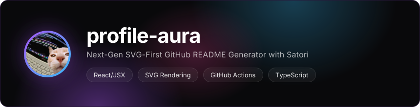
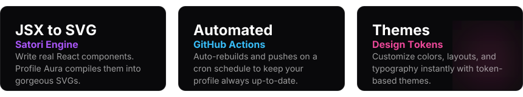
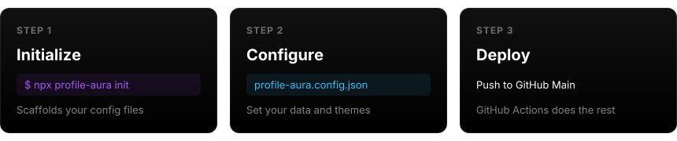

 

Generate incredibly beautiful, animated, and dynamic GitHub profiles using Vercel Satori. **Profile Aura** replaces standard markdown lists and static images with pixel-perfect SVG widgets engineered for aesthetic excellence.

GitHub strips all JS and CSS from README files, but `profile-aura` bypasses this by rendering everything into static SVG images using React JSX at build time!

***

### Features

***

### Quick Start (3 Steps)

Run one command in your repository. It configures the GitHub Actions workflow, generates your config file, and audits your `.gitignore`.

### 🔑 Setting Up Your GitHub Token

To fetch your live GitHub statistics, `profile-aura` requires a Personal Access Token.

> \[!NOTE]
> **If you want to show your private contributions and private repositories then add a token, otherwise there is no need for a token.**

1. Go to **[GitHub Developer Settings](https://github.com/settings/tokens)**.
2. Click **Generate new token (classic)**.
3. Check the following scopes:
   * `repo` (Required to fetch your repository stats)
   * `workflow` (Required to allow the GitHub Action to push the updated README to your repo)
   * `read:user` or `user` (Required to fetch your profile metadata and contributions)
4. Copy the token and add it as a repository secret named `GH_TOKEN` in your profile repository (`Settings > Secrets and variables > Actions`).

***

### CLI Commands

| Command | Description |
|---------|-------------|
| `npx profile-aura init` | Scaffold workflow and configuration files |
| `npx profile-aura build` | Render SVGs and generate README.md locally |
| `npx profile-aura themes` | List all available built-in design themes |
| `npx profile-aura preview` | Open a local live preview of your generated SVGs |
| `npx profile-aura doctor` | Run diagnostics to verify your GitHub token and setup |
| `npx profile-aura studio` | *(Coming Soon)* Launch the visual studio for customizing themes |
| `npx profile-aura ai` | *(Coming Soon)* Generate a unique bio/layout using AI |

 

### 🤝 Contributing & Future Features

We are actively building the future of GitHub profile generation! The `studio` (Visual Editor) and `ai` (AI Layout Generator) commands are currently in development.

If you want to contribute to `profile-aura`, we would love your help! You can contribute by:

* Helping us implement the upcoming `studio` and `ai` features.
* Adding new SVG templates and Satori designs.
* Reporting bugs or fixing existing issues.

Feel free to open an issue or submit a pull request!

***

 

### Why Profile Aura?

`profile-aura` doesn't just generate flat SVGs. It uses advanced Satori rendering coupled with raw SVG injections:

* **Radial Gradients**: Deep space backgrounds (`<radialGradient>`)
* **Glassmorphism**: Semi-transparent backgrounds (`rgba(0,0,0,0.4)`) with backdrop shadows (`<feDropShadow>`).
* **Glows**: Intense neon filters.
* **Animations**: Injected CSS `@keyframes` floating elements that bypass GitHub's Camo sanitizer.

Made with ❤️ by Kalash Mishra

