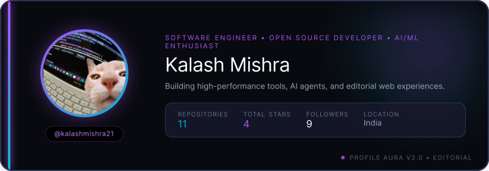

  

  <h3>⚡ Key Metrics & Developer Activity</h3>

<table width="100%" style="border-collapse: collapse; border: none;">
  <tr>
    <td width="50%" valign="top" style="padding: 12px;">
      <h4>📊 Performance & Contributions</h4>
      <ul>
        <li><b>Total Contributions:</b> <code>294</code></li>
        <li><b>Total Commits:</b> <code>280</code></li>
        <li><b>Pull Requests:</b> <code>45</code></li>
        <li><b>Issues Opened:</b> <code>18</code></li>
      </ul>
    </td>
    <td width="50%" valign="top" style="padding: 12px;">
      <h4>⭐ Community Reach & Reach</h4>
      <ul>
        <li><b>Public Repositories:</b> <code>11</code></li>
        <li><b>Stars Earned:</b> <code>4</code></li>
        <li><b>Followers:</b> <code>9</code></li>
        <li><b>Following:</b> <code>12</code></li>
      </ul>
    </td>
  </tr>
</table>

  

  <h3>🛠️ Core Tech Stack & Ecosystem</h3>

**Languages & Core**

`TypeScript`  `JavaScript`  `Python`  `Go`  `HTML5`  `CSS3`

**Frameworks & Libraries**

`React`  `Next.js`  `Node.js`  `Express`  `TailwindCSS`

**Cloud & DevOps**

`Docker`  `Git`  `GitHub Actions`  `Vercel`  `Linux`

  <h3>🌟 Featured Open-Source Repositories</h3>

- **[profile-aura](https://github.com/kalashmishra21/profile-aura)** `TypeScript` ⭐ **0**
  _🎨 AI-powered GitHub README generator with stunning animated SVG cards. Create beautiful profile pages with stats, tech stacks, contribution streaks & more. Powered by Satori, GitHub APIs & OpenAI. Zero maintenance with GitHub Actions automation. ✨_

- **[kalashmishra21](https://github.com/kalashmishra21/kalashmishra21)**  ⭐ **0**
  _No description provided._

- **[LeaveFlow](https://github.com/kalashmishra21/LeaveFlow)** `HTML` ⭐ **1**
  _A Minimal, secure Django authentication system with role-based access control, and Leave Control of employees_

- **[Nomino-Pro](https://github.com/kalashmishra21/Nomino-Pro)** `JavaScript` ⭐ **1**
  _A comprehensive food delivery management platform built with React.js, Node.js, Express.js, and MongoDB. Nomino Pro streamlines restaurant operations and delivery management with real-time tracking, role-based dashboards, and advanced analytics._

- **[MIndfulByte](https://github.com/kalashmishra21/MIndfulByte)** `JavaScript` ⭐ **1**
  _MindfulByte is a web app that delivers daily, bite-sized psychology concepts with real-world examples and quizzes to promote self-awareness and mental well-being in a fun, time-efficient way._

- **[Retail-Basket-Value-Prediction-System](https://github.com/kalashmishra21/Retail-Basket-Value-Prediction-System)** `JavaScript` ⭐ **1**
  _This project is an end-to-end Machine Learning platform designed to predict the total value of a retail invoice (or "basket value") early in the purchase lifecycle._

### 🤝 Connect & Socials

  
  
  

---

  Generated with <a href="https://github.com/kalashmishra21/profile-aura">Profile Aura 2.0</a> • Editorial Portfolio Generator

