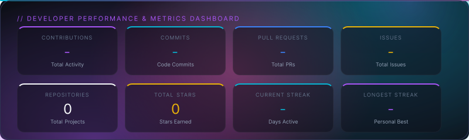
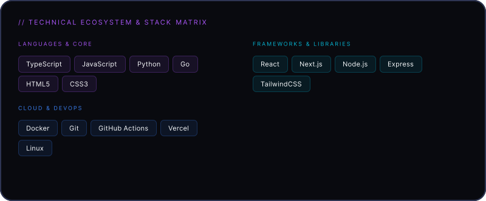

<div align="center">

# ✨ Profile Aura v2

**Premium Editorial Portfolio Generator for GitHub**

[](https://www.npmjs.com/package/profile-aura)
[](https://opensource.org/licenses/MIT)

Profile Aura is a **configuration-driven** CLI tool that generates stunning, magazine-style GitHub README profiles. You just edit a simple JSON file, and Profile Aura automatically fetches your real GitHub contributions via the GraphQL API and compiles your profile into beautiful SVG cards.

</div>

---

## 📸 Preview

*This is a live preview of the generated SVG portfolio.*

<div align="center">





</div>

---

## 🚀 Quick Start

Run the `init` command in your repository to automatically scaffold your configuration and GitHub Actions workflow:

```bash
npx profile-aura init
```

This will create:
- `profile-aura.config.json` (Your profile configuration)
- `.github/workflows/profile-aura.yml` (Automated daily updates)

## 🛠️ Usage

### Local Preview

To build and preview your profile SVGs locally, just run:

```bash
npx profile-aura build
```

This reads from `profile-aura.config.json` and generates the SVGs into your `.github/assets/generated` directory and updates your `README.md`.

### Configuration (`profile-aura.config.json`)

You have full control over the generated portfolio. Here is a sample configuration:

```json
{
  "github": {
    "username": "your-username"
  },
  "profile": {
    "name": "Your Name",
    "roles": ["Software Engineer", "Open Source Developer"],
    "bio": "Building high-performance tools.",
    "socials": {
      "github": "https://github.com/your-username",
      "twitter": "https://twitter.com/your-twitter",
      "email": "mailto:youremail@gmail.com"
    }
  },
  "theme": "black-obsidian"
}
```

## 🔄 Automated Updates

When you run `npx profile-aura init`, it creates a GitHub Actions workflow (`.github/workflows/profile-aura.yml`).

This action automatically runs **every 12 hours** to fetch your latest GitHub commits, PRs, and streak data, re-generates the SVGs, and pushes them to your profile repository automatically!

> **Note**: For the workflow to access your real contribution data, ensure your GitHub Actions have write permissions, or provide a `GITHUB_TOKEN` secret in your repository.

## 🎨 Architecture & Tech Stack

- **JSON-Driven Design**: You don't need to write code. All layouts, themes, and content are generated from a single `profile-aura.config.json` file.
- **Vercel Satori**: Internally converts React/JSX elements directly into scalable vector graphics (SVG) with pixel-perfect accuracy.
- **GitHub GraphQL API**: Fetches real, un-faked statistics including precise commit counts, pull requests, issues, and contribution streaks.

## 📄 License

This project is licensed under the MIT License - see the [LICENSE](LICENSE) file for details.
